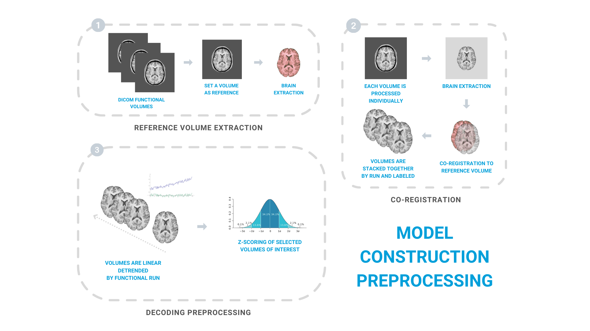

# fMRI Volumes preprocessing
{: .no_toc }

## Table of contents
{: .no_toc .text-delta }

1. TOC
{:toc}

---

## Preprocessing pipeline

Model construction session functional volumes are preprocessed using the same neuroimage software and preprocessing steps as they are preprocessed during real-time fMRI decoding neurofeedback training. This enables to maximize similarity between pipelines and avoid potential confusion variables.

As an starting point, a functional volume is set as reference volume to functional volumes of both model construction and neurofeedback training sessions.

Next, all functional volumes of the decoder construction session are individually corregistered to that reference volume and stacked together by functional run. All volumes are labeled using log files of experimental paradigm used during model construction session runs to identify each volume by its time from corresponding trial onset; its stimuli category; the experimental condition... 

Once all functional volumes are labeled, volumes are linear detrended by fMRI run. Then, some volumes of interest are selected for model construction. Usually these are volumes falling within the Hemodynamic Response Function peak of each trial. Lastly, volumes of interest are Z-scored normalized at voxel level.

Preprocessing scripts of model construction session can be found in *1.model_construction/scripts/1.preprocessing* sorted by required execution order.

Further, the pyDecNef pipeline provides example raw data (i.e., DICOM files) of a model construction session following recommended data structure already set in preprocessing scripts. 

You just have to replace these data with yours, modify scripts to match your experimental settings, and you are ready to go.

 

## 1 - Set an example functional volume as reference

The first preprocessing step consists on selecting 